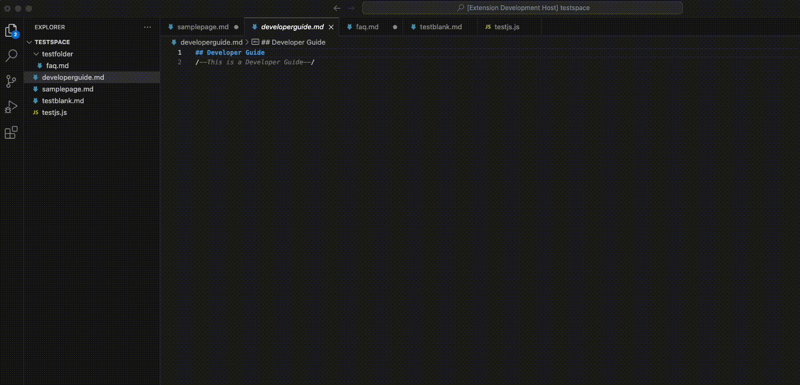
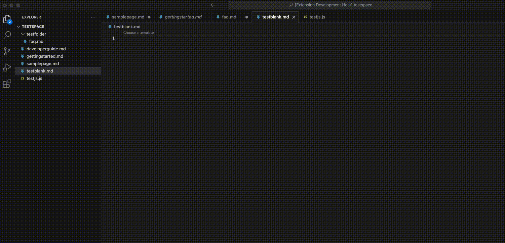
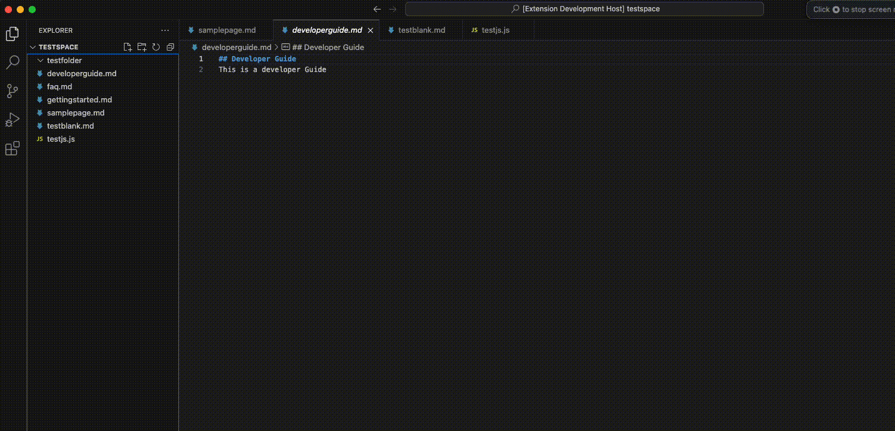
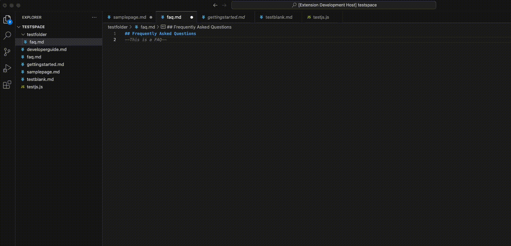

# doc-template README

Work in progress VSCode extension to add documentation templates pulled from a template repo.

## Features

#### Command palette option to choose a template and add it to a specified location

#### Codelens prompt to insert template content into an empty markdown file

#### Additional option in the context menu when right-clicking in the explorer to choose a template and add it to a folder

#### Decorates and automatically deletes when a user types anywhere in a placeholder text chunk

## Requirements

This extension relies on a GH CLI extension to pull templates and add them to a directory.

## Known Issues

This extension is a WIP and currently uses sample templates.
